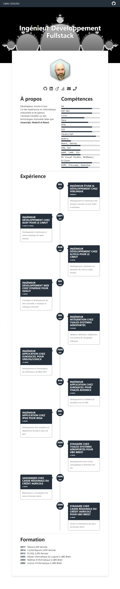

[](https://travis-ci.org/sinsedrix/gatsby-starter-cv)
[](https://badge.fury.io/gh/sinsedrix%2Fgatsby-starter-cv)
[](http://commitizen.github.io/cz-cli/)

<p align="center">
  <a href="https://www.gatsbyjs.org">
    
  </a>
</p>
<h1 align="center">
  Gatsby's CV starter
</h1>

Create your resume in a few minutes with this totally responsive starter using React. Show off your skills, work experiences and activities in github.


## 📷 Preview



## 🚀 Quick start

1.  **Create a Gatsby site.**

    Use the Gatsby CLI to create a new site, specifying the default starter.

    ```sh
    # create a new Gatsby site using the default starter
    npx gatsby new my-default-starter https://github.com/sinsedrix/gatsby-starter-cv
    ```

1.  **Start developing.**

    Navigate into your new site’s directory and start it up.

    ```sh
    cd my-default-starter/
    npm run develop
    ```

1.  **Open the source code and start editing!**

    Your site is now running at `http://localhost:8000`!

    \_Note: You'll also see a second link: `http://localhost:8000/___graphql`. This is a tool you can use to experiment with querying your data. Learn more about using this tool in the [Gatsby tutorial](https://www.gatsbyjs.org/tutorial/part-five/#introducing-graphiql).\_

    Open the `my-default-starter` directory in your code editor of choice and edit `src/pages/index.js`. Save your changes and the browser will update in real time!

1. **Generate production build**

  That command will generate a production build on _public_ folder
  ```sh
    npm run build
  ```

## Configuration

Update the configuration file with your data. The configuration file is in ```data/siteConfig.js```

:warning: NOTE: Please change googleAnalyticsId to your ID.  See https://analytics.google.com for details.

> **Skills** is a set of your personal skills and their respective levels ranging from > 0 to 100.
> **jobs** is a set of your work experiences

```js
module.exports = {
  siteTitle: 'Ingénieur Développement Fullstack',
  siteDescription: `Voici mon CV basé sur un starter Gatsby`,
  keyWords: ['gatsbyjs', 'react', 'curriculum'],
  authorName: 'Cédric COULIOU',
  twitterUsername: 'sinsedrix',
  githubUsername: 'sinsedrix',
  authorAvatar: './images/avatar.jpeg',
  authorDescription: `Développeur, touche à tout. <br />
  J'aimerais travailler sur des technologies d'actualité telles que <strong>Javascript, NodeJS et React.</strong>`,
  skills: [
    {
      name: 'C#',
      level: 80
    },
    {
      name: 'ASP.Net',
      level: 80
    },
    {
      name: 'C/C++',
      level: 60
    },
    {
      name: 'Java',
      level: 70
    },
    {
    name: 'HTML',
      level: 80
    },
    {
      name: 'CSS',
      level: 80
    },
    {
      name: 'Javascript',
      level: 90
    },
    {
      name: 'NodeJs',
      level: 25
    },
    {
      name: 'React',
      level: 50
    },
    {
      name: 'Git',
      level: 50
    }
  ],
  jobs: [
    {
      company: "VERLINGUE",
      begin: {
        month: 'fev',
        year: '2012'
      },
      duration: null,
      occupation: "Ingénieur étude & développement",
      description: "J'y' développe et maintiens les intranets, extranets, services métier et technique."
  
    }, {
      company: "AUSY pour le CIMUT",
      begin: {
        month: 'sept',
        year: '2010'
      },
      duration: '2 ans et 6 mois',
      occupation: "Ingénieur développement",
      description: "Développement, maintenance et refonte graphique de l'appli Starweb."
    }, {
      company: "ALTECA pour le CIMUT",
      begin: {
        month: 'avr',
        year: '2010'
      },
      duration: '6 mois',
      occupation: "Ingénieur développement",
      description: "Développement, maintenance et génération de code sur l'appli Starweb"
    }, {
      company: "Synergie pour Ozalit",
      begin: {
        month: 'fev',
        year: '2010'
      },
      duration: '3 mois',
      occupation: "Ingénieur développement web",
      description: "Conception et développement de sites corporatifs, e-boutiques et catalogues interactifs."
    },
    /* ... */
  ],
  studies: [
    {
      year:'2015',
      degree:"Master Informatique du Logiciel",
      location:"UBO de Brest"
    },
    {
      year:'2013',
      degree:"Maîtrise d''informatique",
      location:"UBO de Brest"
    },
  ],
  social: {
    twitter: "https://twitter.com/sinsedrix",
    linkedin: "https://www.linkedin.com/in/sinsedrix",
    viadeo: "https://fr.viadeo.com/fr/profile/cedric.c1",
    stackOverflow: 'https://stackoverflow.com/users/1177999/sinsedrix',
    //stackExchange: 'https://stackoverflow.com/users/1209090/sinsedrix',
    github: "https://github.com/sinsedrix",
    email: "cedric.couliou@gmail.com",
    phone:"06.75.54.97.19"
  },
  siteUrl: 'https://sinsedrix.github.io/gatsbystarter-cv',
  pathPrefix: '/gatsby-starter-cv', // Note: it must *not* have a trailing slash.
  siteCover: './images/cover.jpeg',
  googleAnalyticsId: 'UA-000000000-1',
  background_color: '#eeffff',
  theme_color: '#25303B',
  display: 'minimal-ui',
  icon: 'src/assets/gatsby-icon.png',
  headerLinks: [
    {
      label: 'Cédric COULIOU',
      url: '/',
    }
  ]
}

```
